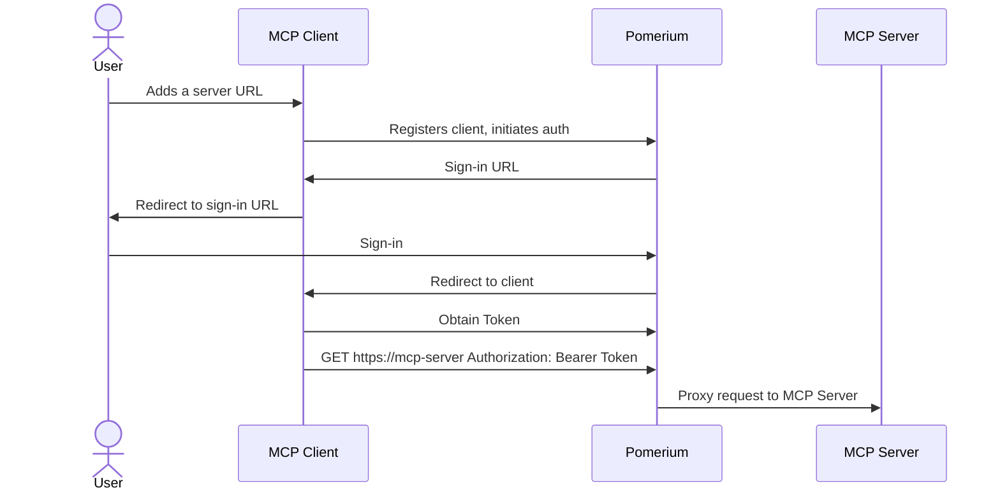
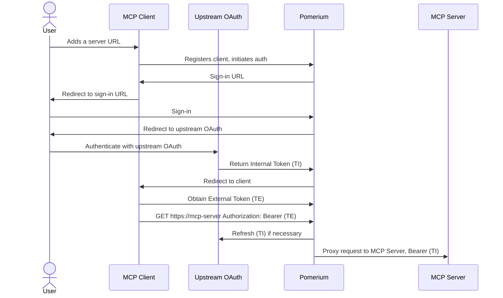
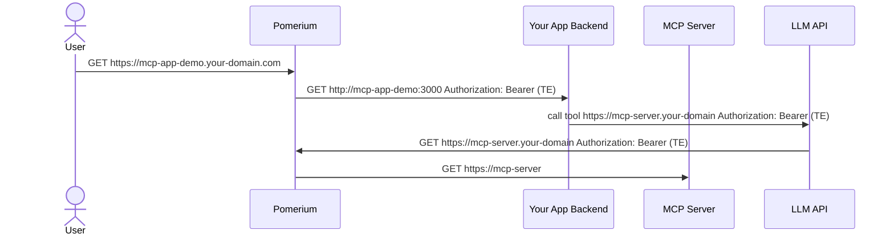

# Overview

This repository contains a collection of reference MCP Streaming HTTP servers designed to work with the Pomerium application gateway. The primary goal is to demonstrate how MCP server development can be simplified by using Pomerium to handle TLS termination, user authentication and authorization, the OAuth 2.1 flow with MCP Clients, and integration with upstream OAuth2 services such as Notion.

**Note:** This is not an official Pomerium product.

# Prerequisites

1. Linux or macOS host
2. Docker and Docker Compose
3. Your machine must have port 443 exposed to the internet to acquire TLS certificates from Let's Encrypt. Public MCP Clients cannot work with self-signed certificates.

# Quick Start

1. Choose your preferred Pomerium installation method below.
2. Configure the relevant MCP server(s):
   - [Notion](./notion/README.md): A tailored Notion MCP server that uses Notion OAuth for the current user and specifically implements [OpenAI Deep Researcher requirements](https://platform.openai.com/docs/mcp).

## Docker Compose Example

Update [`pomerium-config.yaml`](./pomerium-config.yaml) with the configuration for the relevant MCP servers.

```docker
services:
  postgres:
    image: postgres:17
    environment:
      POSTGRES_USER: postgres
      POSTGRES_PASSWORD: postgres
      POSTGRES_DB: pomerium
      POSTGRES_HOST_AUTH_METHOD: trust
    ports:
      - 5432:5432
    volumes:
      - postgres-data:/var/lib/postgresql/data

  pomerium:
    image: pomerium/pomerium:main
    ports:
      - "443:443"
      - "80:80"
    volumes:
      - ./pomerium-config.yaml:/pomerium/config.yaml
      - pomerium-autocert:/data/autocert

  mcp-servers:
    image: pomerium/mcp-servers:latest
    expose:
      - 8080
    environment:
      # See relevant sub-directories for required environment variables, if any

volumes:
  postgres-data:
  pomerium-autocert:
```

# See Also

- [MCP UI App Demo](https://github.com/pomerium/mcp-app-demo): A Node.js/React UI app demonstrating how to build a simple application that calls the OpenAI API with MCP server support.
- [Support Forum](https://discuss.pomerium.com/)
- [Pomerium Docs](https://www.pomerium.com/docs)

# How does it work

[](https://www.youtube.com/watch?v=p0UJ_VlaWxY)

## Token Vocabulary

- **External Token (TE):**
  An externally-facing token issued by Pomerium that represents the user's session. This token is used by external clients (such as Claude.ai, OpenAI, or your own apps) to authenticate requests to Pomerium-protected MCP servers.
  Example: The token you provide to an LLM API or agentic framework to allow it to call your MCP server.

- **Internal Token (TI):**
  An internal authentication token that Pomerium obtains from an upstream OAuth2 provider (such as Notion, Google Drive, GitHub, etc.) on behalf of the user. This token is never exposed to external clients. Pomerium uses this token to authenticate requests to the upstream service when proxying requests to your MCP server.

Pomerium acts as a secure gateway between Model Context Protocol (MCP) clients and servers. It provides authentication and authorization for local HTTP MCP servers, using OAuth 2.1 flows. This setup is especially useful when your MCP server needs to access upstream APIs that require OAuth tokens (such as Notion, Google Drive, GitHub, etc.).

It also enables you to build internal applications that use agentic frameworks or LLM APIs capable of invoking MCP servers, as demonstrated in this repository.

To understand this setup, let's look at how an MCP client communicates with MCP servers that are protected by Pomerium.

## 1. Exposing an Internal MCP Server to a Remote Client

https://github.com/user-attachments/assets/c7a809ad-6f0a-4ea3-94a2-6cf22ea6d27b

Suppose you want to allow an external MCP client (like Claude.ai) to access your internal MCP server, but you want to keep it secure. Pomerium sits in front of your server and manages authentication and authorization for all incoming requests.

This means you can safely share access to internal resources (like a database) with external clients, without exposing them directly to the internet.

You configure your Pomerium Route as usual with an additional `mcp` property that signifies that this route represents a Model Context Protocol server route.

```yaml
routes:
  - from: https://my-mcp-server.your-domain.com
    to: http://my-mcp-server.int:8080/mcp
    name: My MCP Server
    mcp: {}
```



## 2. MCP Server Needs Upstream OAuth

If your MCP server needs to access an upstream service that requires OAuth (for example, GitHub or Google Drive), Pomerium can handle the OAuth flow for you. Here’s how the process works:

1. The user adds the MCP server URL in the client (e.g., Claude.ai).
2. The client registers with Pomerium and starts authentication.
3. Pomerium gives the client a sign-in URL, which is shown to the user.
4. The user signs in to Pomerium, then is redirected to the upstream OAuth provider.
5. The user authenticates with the upstream provider. The provider returns an **Internal Token (TI)** to Pomerium.
6. Pomerium finishes the sign-in and redirects the user back to the client.
7. The client receives an **External Token (TE)** from Pomerium.
8. The client uses **TE** to make requests to the MCP server.
9. Pomerium refreshes the upstream token (**TI**) as needed and proxies requests to the MCP server, passing **TI** in the `Authorization` header.

**Key benefits:**

- External clients (like Claude.ai) never see your upstream OAuth tokens.
- Your MCP server always receives a valid upstream token.
- The MCP server can remain stateless and does not need to manage OAuth flows or tokens.

**Route configuration:**

```yaml
routes:
  - from: https://github.your-domain
    to: http://github-mcp.int:8080/mcp
    name: GitHub
    mcp:
      upstream_oauth2:
        client_id: xxxxxxxxxxxx
        client_secret: yyyyyyyyy
        scopes: ['read:user', 'user:email']
        endpoint:
          auth_url: 'https://github.com/login/oauth/authorize'
          token_url: 'https://github.com/login/oauth/access_token'
```



### 3. Calling internal MCP server from your app

Some inference APIs, such as the [OpenAI API](https://platform.openai.com/docs/guides/tools-remote-mcp) and [Claude API](https://docs.anthropic.com/en/docs/agents-and-tools/mcp-connector), now support direct invocation of MCP servers. This trend is expected to grow, and many agentic frameworks are adding support for MCP server calls. You can also implement MCP tool calls manually in your app using LLM function calling capabilities. All these approaches require providing an `Authorization: Bearer` **External Token (TE)** for the MCP server so that requests can be securely routed through Pomerium.

If you are building your own internal application and need to obtain such a token, Pomerium offers a _client MCP mode_ for routes. By setting the `mcp.pass_upstream_access_token` option, Pomerium will supply your upstream application with an `Authorization: Bearer` **External Token (TE)** representing the current user session. You can then pass this token to external LLMs or agentic frameworks, allowing them to access MCP servers behind Pomerium according to your authorization policy.

The following flow illustrates this process, assuming the user is already authenticated with Pomerium:



Example route configuration:

```yaml
routes:
  - from: https://mcp-app-demo.your-domain.com
    to: http://mcp-app-demo:3000
    mcp:
      pass_upstream_access_token: true
    policy: {} # define your policy here
  - from: https://mcp-server.your-domain.com
    to: http://mcp-server.int:8080/mcp
    name: My MCP Server
    mcp: {}
    policy: {} # define your policy here
```

### 4. Listing available MCP servers from your app

You can provide users with a dynamic list of MCP servers protected by the same Pomerium instance as your application. To do this, issue an HTTP request to your app backend using the same `Authorization: Bearer` token your backend received. The response will include the list and connection status of each MCP server upstream available to this Pomerium cluster.

The **connected** property indicates whether the current user has all required internal tokens for upstream OAuth (if needed):

- **true** – The user has all required internal tokens from upstream OAuth providers, or none are required for this server.
- **false** – The user needs to authenticate with the upstream OAuth provider before accessing this MCP server.

A later section will explain how to ensure your user has all required internal tokens.

```
GET https://mcp-demo-app.yourdomain.com/.pomerium/mcp/routes HTTP/1.1
Accept: application/json
Authorization: Bearer (TE)

Content-Type: application/json
{
    "servers": [
        {
            "name": "DB",
            "url": "https://db-mcp.your-domain.com",
            "connected": true
        },
        {
            "name": "GitHub",
            "url": "https://github-mcp.your-domain.com",
            "connected": false
        }
    ]
}
```

## 5. Ensuring your current user has authenticated with an upstream OAuth2 provider

If your target MCP server shows `connected: false`, the user needs to authenticate with the required upstream OAuth2 provider.
To do this, redirect the user's browser to the special `/.pomerium/mcp/connect` path on the MCP server route (for example: `https://db-mcp.your-domain.com/.pomerium/mcp/connect`).
Include a `redirect_url` query parameter that points back to your application's page—this is where the user should return after authentication, and where you can reload the MCP server list and their connection status.

**Note:** For security, the `redirect_url` must be a host that matches one of your MCP Client routes.

After the user completes authentication, the MCP server's `connected` status should become `true`.

## 6. Obtaining User Details

To access the authenticated user's identity and claims, both your MCP client application and MCP server should read the [`X-Pomerium-Assertion`](https://www.pomerium.com/docs/get-started/fundamentals/core/jwt-verification#manually-verify-the-jwt) HTTP header.
This header contains a signed JWT with user information, which you can decode and verify to obtain details such as the user's email, name, and other claims.
